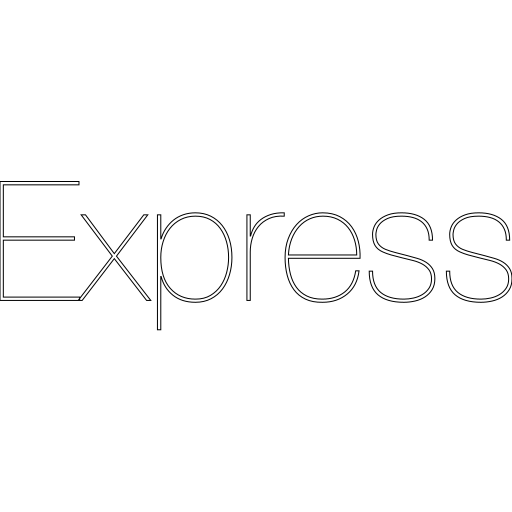

<h1 align="center">Welcome to my GitHub profile! 👋</h1>  
  

  

Hello! I have acquired essential programming skills and am interested in developing practical solutions and applications. I value teamwork and continuous learning. Excited to be part of the developer community and looking forward to future opportunities.

-   🔭 I’m currently working on [Recipe Explorer](https://github.com/lean0mar/recipe-explorer).

-   🌱 I’m currently learning **English and Python**.

-   👨‍💻 All of my projects are available at [repostories](https://github.com/Lean0mar?tab=repositories).

-   ⚡ Fun fact **I love to listen to music, drink copious amounts of coffee, and of course, program!**.

 
 
<h2 align="center">✨ Stats</h2>

&nbsp;

 
 

 
 
<h2 align="center">🔥 Current Streak</h2>

 
 

<h2 align="center">📋 Project</h2>

On my GitHub profile, you will find a variety of projects I have worked on, from small experiments to larger and more complete projects. Here are some examples:

-   [Recipe Explorer](https://github.com/lean0mar/recipe-explorer): A web application that allows users to explore, search, and manage recipes, integrating local recipes and external sources through the Spoonacular API. Built with React, TypeScript, Node.js, and MongoDB, featuring a modern, responsive design with TailwindCSS.

-   [JobPortalX](https://github.com/Lean0mar/JobPortalX): The final project, named "JobPortalX," is a job portal that utilizes technologies such as React, Redux, Node.js, Express, Sequelize, among others. It allows users to search, filter, and sort job listings, authenticate using local or third-party credentials, process secure payments, leave reviews, and store data locally. The project also includes an admin panel and a notification system.

I am always looking for opportunities to improve my skills and learn new things, so I would love to receive feedback and suggestions on any projects you find on my profile.

 
 
<h2 align="center">🏆 Trophies</h2>

  
 
 

<h2 align="center">⚡ Languages and Tools</h2>
<table align="center">
  <tr>
    <td align="center" width="96">
      
       HTML
    </td>
    <td align="center" width="96">
      
       CSS
    </td>
    <td align="center" width="96">
      
       JavaScript
    </td>
    <td align="center" width="96">
      
       TypeScript
    </td>
  </tr>
  <tr>
    <td align="center" width="96">
      
       React
    </td>
    <td align="center" width="96">
      
       React Native
    </td>
    <td align="center" width="96">
      
       Redux
    </td>
    <td align="center" width="96">
      
       Redux Toolkit
    </td>
  </tr>
  <tr>
    <td align="center" width="96">
      
       Node.js
    </td>
    <td align="center" width="96">
      
       Express
    </td>
    <td align="center" width="96">
      
       PostgreSQL
    </td>
    <td align="center" width="96">
      
       MySQL
    </td>
  </tr>
  <tr>
    <td align="center" width="96">
      
       Parse Server
    </td>
    <td align="center" width="96">
      
       MongoDB
    </td>
    <td align="center" width="96">
      
       Sequelize
    </td>
    <td align="center" width="96">
      
       Mongoose
    </td>
  </tr>
  <tr>
    <td align="center" width="96">
      
       Bootstrap
    </td>
    <td align="center" width="96">
      
       Tailwind CSS
    </td>
    <td align="center" width="96">
      
       Postman
    </td>
    <td align="center" width="96">
      
       Git
    </td>
  </tr>
</table>

 
 
<h2 align="center">📓 Top languages usage</h2>

 
 

<h2 align="center">📫 Contact</h2>

Thank you for visiting my GitHub profile! If you have any questions or would like to know more about my work, please don't hesitate to contact me. I hope to hear from you soon!

  
  
  

